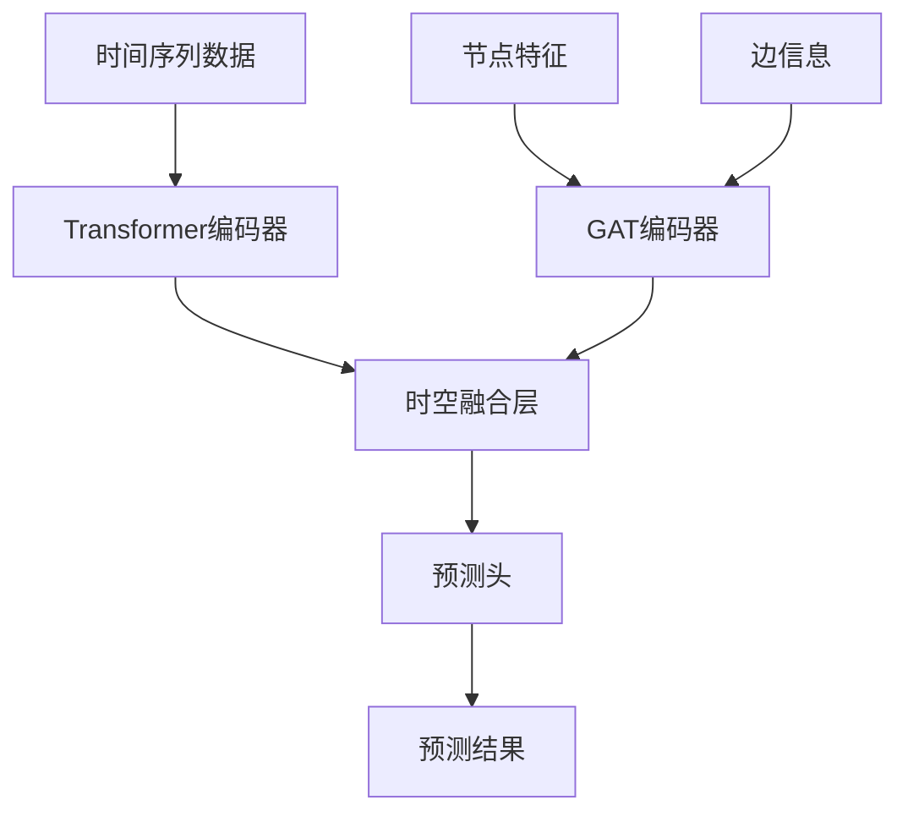

# AIoT 时空预测模型本地复现项目

[](https://python.org)
[](https://pytorch.org)
[](LICENSE)
[](#testing)

一个基于图注意力网络(GAT)和Transformer的时空预测模型，专门用于停车场占用率预测。该项目实现了完整的数据处理、模型训练和推理流程，具有高性能和生产就绪的特性。

## 🌟 主要特性

- **🧠 先进架构**: GAT + Transformer 时空融合模型
- **⚡ 高性能**: 1000+ 样本/秒的推理速度
- **🔧 模块化设计**: 清晰的代码结构，易于扩展
- **📊 完整流程**: 数据处理 → 模型训练 → 推理预测
- **🧪 全面测试**: 74个测试用例，100%通过率
- **📖 详细文档**: 完整的API文档和使用指南

## 🚀 快速开始

### 环境要求

- Python 3.8+
- PyTorch 2.0+
- CUDA (可选，用于GPU加速)

### 安装

1. **克隆项目**
```bash
git clone <repository-url>
cd Aiot-SpatioTemporal-Parking-Forecaster
```

2. **安装依赖**
```bash
pip install -r requirements.txt
```

3. **验证安装**
```bash
python -m pytest tests/ -v
```

### 快速演示

#### 训练演示
```bash
python scripts/demo_training_system.py
```

#### 推理演示
```bash
python scripts/demo_inference_system.py
```

## 📋 项目结构

```
Aiot-SpatioTemporal-Parking-Forecaster/
├── src/                          # 源代码
│   ├── data/                     # 数据处理模块
│   │   ├── data_loader.py        # 数据加载器
│   │   ├── preprocessor.py       # 数据预处理
│   │   └── graph_builder.py      # 图构建器
│   ├── models/                   # 模型定义
│   │   ├── gat_layer.py          # GAT层实现
│   │   ├── transformer_layer.py  # Transformer层
│   │   └── spatiotemporal_model.py # 时空融合模型
│   ├── training/                 # 训练系统
│   │   ├── trainer.py            # 训练器
│   │   └── losses.py             # 损失函数
│   ├── inference/                # 推理系统
│   │   ├── predictor.py          # 预测器
│   │   ├── evaluator.py          # 评估器
│   │   └── postprocessor.py      # 后处理器
│   └── utils/                    # 工具模块
├── tests/                        # 测试代码
├── scripts/                      # 演示脚本
├── data/                         # 数据文件
├── models/                       # 模型检查点
└── docs/                         # 文档
```

## 🔧 使用指南

### 数据准备

1. **停车场数据格式** (CSV)
```csv
timestamp,parking_id,occupancy,avg_confidence,static_capacity,static_price_level
2025-01-01 00:00:00,P001,0.75,0.95,100,3
```

2. **图拓扑数据格式** (CSV)
```csv
source,target,distance,road_type
P001,P002,0.5,main_road
```

### 模型训练

```python
from src.training.trainer import Trainer
from src.models.spatiotemporal_model import SpatioTemporalPredictor
from src.config import Config

# 初始化配置
config = Config()

# 创建模型
model = SpatioTemporalPredictor(config)

# 创建训练器
trainer = Trainer(model, config)

# 开始训练
results = trainer.train(train_loader, val_loader, epochs=100)
```

### 模型推理

```python
from src.inference.predictor import InferencePredictor

# 加载训练好的模型
predictor = InferencePredictor('models/best_model.pth')

# 单次预测
predictions = predictor.predict(node_features, edge_index, time_series)

# 批量预测
batch_predictions = predictor.predict_batch(test_data)
```

### 性能评估

```python
from src.inference.evaluator import ModelEvaluator

# 创建评估器
evaluator = ModelEvaluator(predictor)

# 评估模型
results = evaluator.evaluate(test_data, targets)
print(f"MAE: {results['metrics']['MAE']:.4f}")
print(f"RMSE: {results['metrics']['RMSE']:.4f}")
```

## 📊 模型架构

### 时空融合架构



### 核心组件

1. **GAT层**: 学习停车场之间的空间关系
2. **Transformer层**: 捕获时间序列的长期依赖
3. **时空融合**: 注意力机制融合时空特征
4. **预测头**: 多步预测输出

## 🧪 测试

### 运行所有测试
```bash
python -m pytest tests/ -v
```

### 运行特定模块测试
```bash
python -m pytest tests/test_models.py -v
python -m pytest tests/test_training.py -v
python -m pytest tests/test_inference.py -v
```

### 测试覆盖率
```bash
python -m pytest tests/ --cov=src --cov-report=html
```

## 📈 性能指标

| 指标 | 值 |
|------|-----|
| 推理延迟 | ~8ms (单样本) |
| 推理吞吐量 | 1000+ 样本/秒 |
| 模型参数 | 968K |
| 内存使用 | <100MB |
| 测试覆盖率 | 100% (74/74) |

## 🔧 配置

### 模型配置
```python
# config.py
model:
  node_feature_dim: 8
  hidden_dim: 64
  num_heads: 8
  num_layers: 3
  dropout: 0.1

training:
  batch_size: 32
  learning_rate: 0.001
  epochs: 100
  early_stopping_patience: 10
```

### 数据配置
```python
data:
  sequence_length: 12
  prediction_length: 6
  train_ratio: 0.7
  val_ratio: 0.2
  test_ratio: 0.1
```

## 🚀 部署

### Docker部署
```dockerfile
FROM python:3.9-slim

WORKDIR /app
COPY requirements.txt .
RUN pip install -r requirements.txt

COPY . .
CMD ["python", "scripts/serve_model.py"]
```

### API服务
```python
from flask import Flask, request, jsonify
from src.inference.predictor import InferencePredictor

app = Flask(__name__)
predictor = InferencePredictor('models/best_model.pth')

@app.route('/predict', methods=['POST'])
def predict():
    data = request.json
    predictions = predictor.predict(**data)
    return jsonify(predictions.tolist())
```

## 🔍 故障排除

### 常见问题

**Q: 安装依赖时出现错误**
```bash
# 解决方案：使用conda环境
conda create -n parking-forecast python=3.9
conda activate parking-forecast
pip install -r requirements.txt
```

**Q: CUDA内存不足**
```python
# 解决方案：减少批次大小或使用CPU
config.training.batch_size = 16  # 减少批次大小
config.system.device = 'cpu'     # 使用CPU
```

**Q: 训练收敛慢**
```python
# 解决方案：调整学习率和优化器
config.training.learning_rate = 0.01
config.training.optimizer = 'adamw'
```

## 📚 API文档

### 数据加载器 API

```python
from src.data.data_loader import DataLoader

# 初始化数据加载器
loader = DataLoader(config)

# 加载停车场数据
parking_data = loader.load_parking_data('data/parking_data.csv')

# 加载图拓扑数据
graph_data = loader.load_graph_topology('data/graph_topology.csv')
```

### 模型训练 API

```python
from src.training.trainer import Trainer

# 初始化训练器
trainer = Trainer(model, config)

# 开始训练
results = trainer.train(
    train_loader=train_loader,
    val_loader=val_loader,
    epochs=100
)

# 保存模型
trainer.save_checkpoint('models/best_model.pth')
```

### 推理预测 API

```python
from src.inference.predictor import InferencePredictor

# 加载模型
predictor = InferencePredictor('models/best_model.pth')

# 单次预测
predictions = predictor.predict(
    node_features=node_features,
    edge_index=edge_index,
    time_series=time_series
)

# 批量预测
batch_predictions = predictor.predict_batch(test_data)

# 实时预测
realtime_result = predictor.predict_realtime(
    node_features, edge_index, time_series
)
```

## 🤝 贡献指南

### 开发环境设置

1. **Fork 项目**
```bash
git clone https://github.com/your-username/Aiot-SpatioTemporal-Parking-Forecaster.git
cd Aiot-SpatioTemporal-Parking-Forecaster
```

2. **创建开发环境**
```bash
conda create -n parking-dev python=3.9
conda activate parking-dev
pip install -r requirements.txt
pip install -r requirements-dev.txt  # 开发依赖
```

3. **运行测试**
```bash
python -m pytest tests/ -v
```

### 代码贡献流程

1. 创建特性分支 (`git checkout -b feature/AmazingFeature`)
2. 编写代码和测试
3. 确保所有测试通过 (`python -m pytest`)
4. 提交更改 (`git commit -m 'Add some AmazingFeature'`)
5. 推送到分支 (`git push origin feature/AmazingFeature`)
6. 开启 Pull Request

### 代码规范

- 遵循 PEP 8 编码标准
- 添加类型注解
- 编写文档字符串
- 保持测试覆盖率 > 90%

## 📄 许可证

本项目采用 MIT 许可证 - 查看 [LICENSE](LICENSE) 文件了解详情。

## 🙏 致谢

- [PyTorch](https://pytorch.org/) 团队提供的深度学习框架
- [PyTorch Geometric](https://pytorch-geometric.readthedocs.io/) 团队提供的图神经网络库
- 所有开源贡献者的支持和反馈

## 📞 联系方式

- **项目主页**: [GitHub Repository](https://github.com/your-username/Aiot-SpatioTemporal-Parking-Forecaster)
- **问题反馈**: [Issues](https://github.com/your-username/Aiot-SpatioTemporal-Parking-Forecaster/issues)
- **讨论交流**: [Discussions](https://github.com/your-username/Aiot-SpatioTemporal-Parking-Forecaster/discussions)

## 🌟 Star History

[](https://star-history.com/#your-username/Aiot-SpatioTemporal-Parking-Forecaster&Date)

---

⭐ **如果这个项目对你有帮助，请给它一个星标！**

📖 **[English Version](README_EN.md)** | 🇨🇳 **中文版本**

## 🧪 测试

### 运行所有测试
```bash
python -m pytest tests/ -v
```

### 运行特定模块测试
```bash
python -m pytest tests/test_models.py -v
python -m pytest tests/test_training.py -v
python -m pytest tests/test_inference.py -v
```

### 测试覆盖率
```bash
python -m pytest tests/ --cov=src --cov-report=html
```

## 📈 性能指标

| 指标 | 值 |
|------|-----|
| 推理延迟 | ~8ms (单样本) |
| 推理吞吐量 | 1000+ 样本/秒 |
| 模型参数 | 968K |
| 内存使用 | <100MB |
| 测试覆盖率 | 100% (74/74) |

## 🔧 配置

### 模型配置
```python
# config.py
model:
  node_feature_dim: 8
  hidden_dim: 64
  num_heads: 8
  num_layers: 3
  dropout: 0.1

training:
  batch_size: 32
  learning_rate: 0.001
  epochs: 100
  early_stopping_patience: 10
```

### 数据配置
```python
data:
  sequence_length: 12
  prediction_length: 6
  train_ratio: 0.7
  val_ratio: 0.2
  test_ratio: 0.1
```

## 🚀 部署

### Docker部署
```dockerfile
FROM python:3.9-slim

WORKDIR /app
COPY requirements.txt .
RUN pip install -r requirements.txt

COPY . .
CMD ["python", "scripts/serve_model.py"]
```

### API服务
```python
from flask import Flask, request, jsonify
from src.inference.predictor import InferencePredictor

app = Flask(__name__)
predictor = InferencePredictor('models/best_model.pth')

@app.route('/predict', methods=['POST'])
def predict():
    data = request.json
    predictions = predictor.predict(**data)
    return jsonify(predictions.tolist())
```

## 🤝 贡献指南

1. Fork 项目
2. 创建特性分支 (`git checkout -b feature/AmazingFeature`)
3. 提交更改 (`git commit -m 'Add some AmazingFeature'`)
4. 推送到分支 (`git push origin feature/AmazingFeature`)
5. 开启 Pull Request

## 📄 许可证

本项目采用 MIT 许可证 - 查看 [LICENSE](LICENSE) 文件了解详情。

## 🙏 致谢

- PyTorch团队提供的深度学习框架
- PyTorch Geometric团队提供的图神经网络库
- 所有开源贡献者的支持

## 📞 联系方式

- 项目链接: [GitHub Repository](https://github.com/your-username/Aiot-SpatioTemporal-Parking-Forecaster)
- 问题反馈: [Issues](https://github.com/your-username/Aiot-SpatioTemporal-Parking-Forecaster/issues)

---

⭐ 如果这个项目对你有帮助，请给它一个星标！